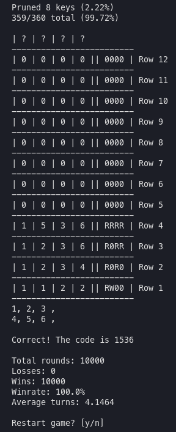

# mastermind

## Prerequisites

- Ruby
- Ruby gem: `gem install pry-byebug`
- Git

## Usage

1. Open terminal, go to a directory
2. `git clone git@github.com:DorielRivalet/mastermind.git`
3. `cd mastermind/src`
4. `ruby main.rb`

## Game modes

- Codecracker
- Codemaker
- CPU vs CPU (+ bonus mode: benchmark)

Have fun!
